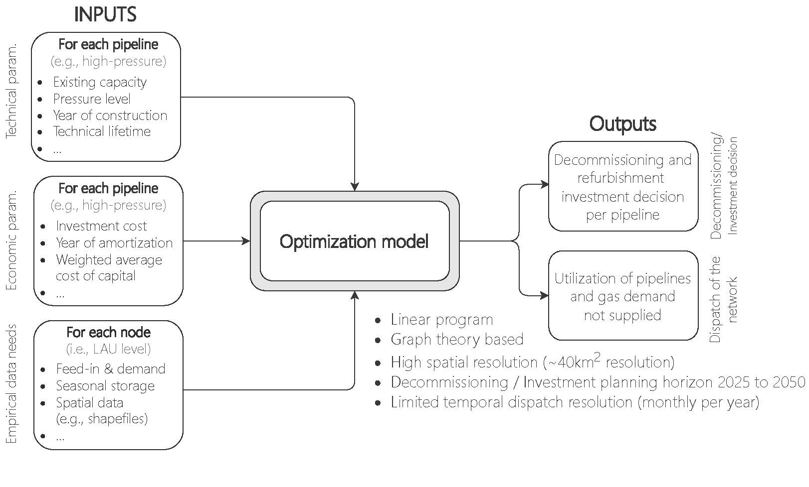

# GNDMod (Gas Network Decommissioning Model)

Cost-optimal gas infrastructure refurbishment investment and decomissioning model

Copyright (c) 2021 Energy Economics Group (EEG), Technische Universität Wien, Sebastian Zwickl-Bernhard

## Overview

	

